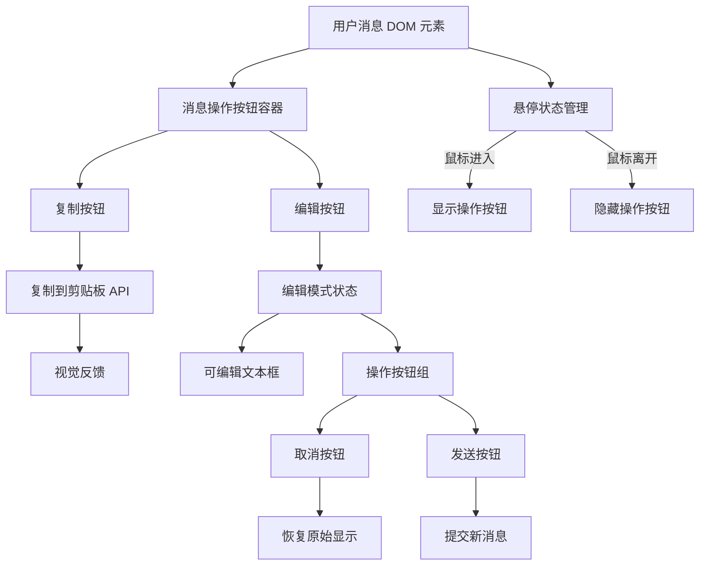
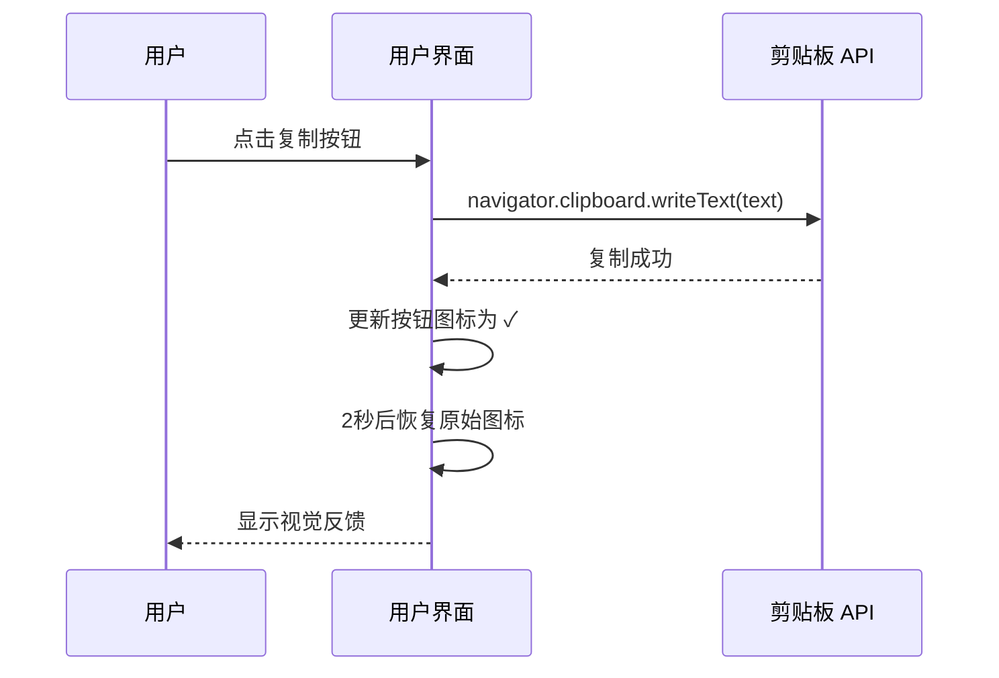
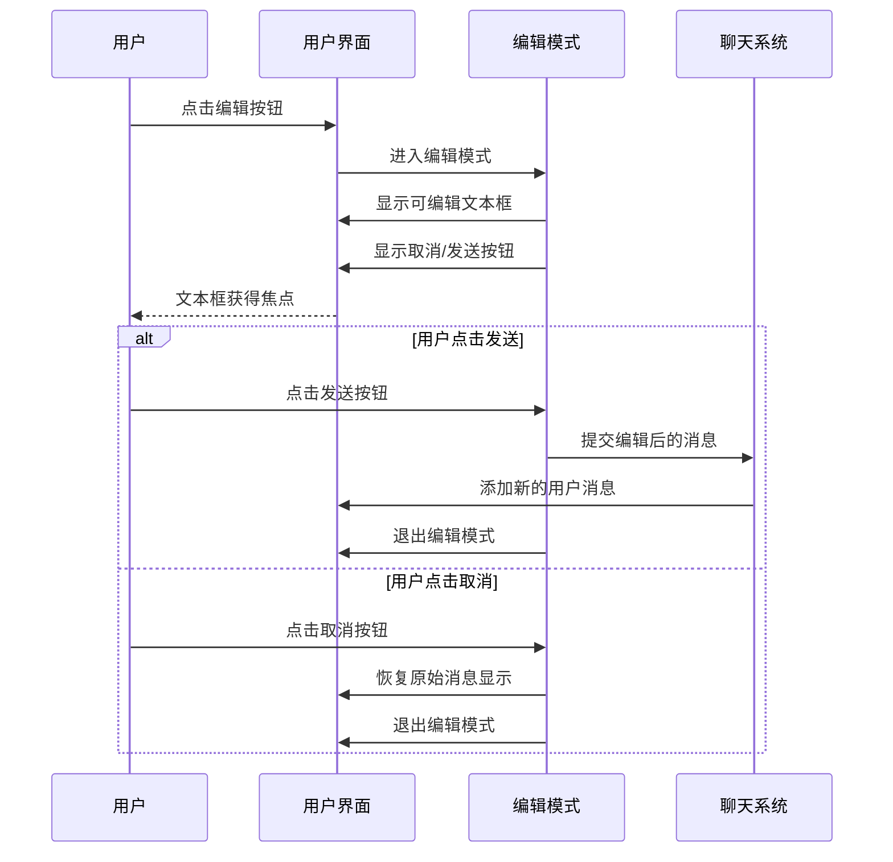

# Design Document: User Message Actions

## Overview

为聊天界面中的用户消息添加操作按钮功能，包括复制消息内容和编辑消息两个核心功能。该功能将增强用户与聊天界面的交互体验，允许用户快速复制之前发送的消息内容，或者修改已发送的消息并重新提交。操作按钮采用悬停显示（hover-to-show）交互模式，默认隐藏，仅在用户鼠标悬停在消息上时显示，提供更简洁的界面体验。设计遵循现有 UI 风格，使用原生 JavaScript 和 CSS 实现，无需引入额外框架。

## Architecture



## Sequence Diagrams

### 复制消息流程



### 编辑消息流程



## Components and Interfaces

### Component 1: MessageActionsManager

**Purpose**: 管理用户消息的操作按钮（复制、编辑）的创建、事件绑定、悬停交互和状态管理

**Interface**:
```javascript
class MessageActionsManager {
  /**
   * 为用户消息添加操作按钮
   * @param {HTMLElement} messageElement - 用户消息的 DOM 元素
   * @param {string} messageText - 消息的原始文本内容
   */
  addActionsToMessage(messageElement, messageText) {}
  
  /**
   * 创建操作按钮容器
   * @returns {HTMLElement} 包含复制和编辑按钮的容器元素
   */
  createActionsContainer() {}
  
  /**
   * 设置悬停交互行为
   * @param {HTMLElement} messageElement - 消息元素
   * @param {HTMLElement} actionsContainer - 操作按钮容器
   */
  setupHoverBehavior(messageElement, actionsContainer) {}
  
  /**
   * 处理复制操作
   * @param {string} text - 要复制的文本
   * @param {HTMLElement} button - 复制按钮元素
   */
  handleCopy(text, button) {}
  
  /**
   * 处理编辑操作
   * @param {HTMLElement} messageElement - 消息元素
   * @param {string} originalText - 原始消息文本
   */
  handleEdit(messageElement, originalText) {}
  
  /**
   * 退出编辑模式
   * @param {HTMLElement} messageElement - 消息元素
   * @param {string} originalText - 原始消息文本
   */
  exitEditMode(messageElement, originalText) {}
  
  /**
   * 提交编辑后的消息
   * @param {HTMLElement} messageElement - 消息元素
   * @param {string} newText - 编辑后的文本
   */
  submitEditedMessage(messageElement, newText) {}
}
```

**Responsibilities**:
- 创建和渲染操作按钮 UI
- 管理按钮的悬停显示/隐藏行为
- 绑定按钮点击事件处理器
- 管理编辑模式的状态切换
- 与剪贴板 API 交互
- 与现有的消息发送系统集成

### Component 2: ClipboardHandler

**Purpose**: 封装剪贴板操作，提供统一的复制接口和错误处理

**Interface**:
```javascript
class ClipboardHandler {
  /**
   * 复制文本到剪贴板
   * @param {string} text - 要复制的文本
   * @returns {Promise<boolean>} 复制是否成功
   */
  async copyToClipboard(text) {}
  
  /**
   * 显示复制成功的视觉反馈
   * @param {HTMLElement} button - 按钮元素
   * @param {number} duration - 反馈持续时间（毫秒）
   */
  showCopyFeedback(button, duration = 2000) {}
}
```

**Responsibilities**:
- 调用 Clipboard API 执行复制操作
- 处理复制失败的降级方案（document.execCommand）
- 提供视觉反馈机制

### Component 3: EditModeRenderer

**Purpose**: 负责渲染和管理编辑模式的 UI 状态

**Interface**:
```javascript
class EditModeRenderer {
  /**
   * 渲染编辑模式 UI
   * @param {HTMLElement} messageElement - 消息元素
   * @param {string} originalText - 原始文本
   * @returns {Object} 包含 textarea 和按钮的对象
   */
  renderEditMode(messageElement, originalText) {}
  
  /**
   * 创建可编辑文本框
   * @param {string} text - 初始文本内容
   * @returns {HTMLTextAreaElement} 文本框元素
   */
  createEditableTextarea(text) {}
  
  /**
   * 创建编辑操作按钮组（取消、发送）
   * @returns {HTMLElement} 按钮组容器
   */
  createEditButtons() {}
  
  /**
   * 恢复原始消息显示
   * @param {HTMLElement} messageElement - 消息元素
   * @param {string} originalText - 原始文本
   */
  restoreOriginalMessage(messageElement, originalText) {}
}
```

**Responsibilities**:
- 创建编辑模式的 UI 元素（文本框、按钮）
- 管理编辑模式和普通模式之间的 DOM 切换
- 处理文本框的自动聚焦和尺寸调整

## Data Models

### MessageActionState

```javascript
/**
 * 消息操作状态
 */
interface MessageActionState {
  /** 消息元素的唯一标识 */
  messageId: string;
  
  /** 是否处于编辑模式 */
  isEditing: boolean;
  
  /** 原始消息文本 */
  originalText: string;
  
  /** 编辑中的文本（仅在编辑模式下） */
  editingText?: string;
  
  /** 消息元素的 DOM 引用 */
  messageElement: HTMLElement;
}
```

**Validation Rules**:
- `messageId` 必须唯一且非空
- `originalText` 不能为空字符串
- `isEditing` 为 true 时，`editingText` 必须存在

### ActionButtonConfig

```javascript
/**
 * 操作按钮配置
 */
interface ActionButtonConfig {
  /** 按钮图标（emoji 或文本） */
  icon: string;
  
  /** 按钮标题（hover 提示） */
  title: string;
  
  /** 按钮类名 */
  className: string;
  
  /** 点击事件处理器 */
  onClick: (event: Event) => void;
}
```

**Validation Rules**:
- `icon` 和 `title` 必须非空
- `className` 必须符合 CSS 类名规范
- `onClick` 必须是有效的函数

## Key Functions with Formal Specifications

### Function 1: addActionsToMessage()

```javascript
function addActionsToMessage(messageElement, messageText)
```

**Preconditions:**
- `messageElement` 是有效的 DOM 元素且包含 `.message-content` 子元素
- `messageText` 是非空字符串
- `messageElement` 尚未添加操作按钮（避免重复添加）

**Postconditions:**
- 在 `messageElement` 的 `.message-content` 中添加了操作按钮容器
- 操作按钮容器包含复制和编辑两个按钮
- 操作按钮容器默认隐藏（opacity: 0 或 visibility: hidden）
- 两个按钮都已绑定相应的事件处理器
- 消息元素已绑定 mouseenter 和 mouseleave 事件以控制按钮显示
- 不影响消息的原始文本显示

**Loop Invariants:** N/A

### Function 2: setupHoverBehavior()

```javascript
function setupHoverBehavior(messageElement, actionsContainer)
```

**Preconditions:**
- `messageElement` 是有效的用户消息 DOM 元素
- `actionsContainer` 是有效的操作按钮容器元素
- `actionsContainer` 已添加到 `messageElement` 的 DOM 树中

**Postconditions:**
- 当鼠标进入 `messageElement` 时，`actionsContainer` 变为可见
- 当鼠标离开 `messageElement` 时，`actionsContainer` 变为隐藏
- 过渡动画流畅（使用 CSS transition）

**Loop Invariants:** N/A

### Function 3: handleCopy()

```javascript
async function handleCopy(text, button)
```

**Preconditions:**
- `text` 是非空字符串
- `button` 是有效的 DOM 元素
- 浏览器支持 Clipboard API 或 document.execCommand

**Postconditions:**
- 文本已成功复制到剪贴板，或显示错误提示
- 按钮图标临时变为 ✓（成功）或 ✗（失败）
- 2秒后按钮图标恢复为原始状态 📋
- 不改变页面的其他状态

**Loop Invariants:** N/A

### Function 4: handleEdit()

```javascript
function handleEdit(messageElement, originalText)
```

**Preconditions:**
- `messageElement` 是有效的用户消息 DOM 元素
- `originalText` 是非空字符串
- 消息当前不处于编辑模式

**Postconditions:**
- 消息进入编辑模式
- 原始消息文本被替换为可编辑的 textarea
- 显示取消和发送按钮
- textarea 获得焦点且光标位于文本末尾
- 操作按钮（复制、编辑）被隐藏

**Loop Invariants:** N/A

### Function 5: submitEditedMessage()

```javascript
function submitEditedMessage(messageElement, newText)
```

**Preconditions:**
- `messageElement` 处于编辑模式
- `newText` 是经过 trim() 处理的非空字符串
- 聊天系统处于可接收消息状态（非等待响应状态）

**Postconditions:**
- 退出编辑模式，恢复原始消息显示
- 新消息通过现有的消息发送系统提交
- 新消息显示在聊天界面中
- 触发后端 API 调用（如果适用）

**Loop Invariants:** N/A

## Algorithmic Pseudocode

### Main Workflow Algorithm

```pascal
ALGORITHM initializeMessageActions()
INPUT: None
OUTPUT: None

BEGIN
  // 监听新消息添加事件
  OBSERVE messagesContainer FOR new user messages
  
  FOR each newUserMessage IN messagesContainer DO
    messageText ← EXTRACT text FROM newUserMessage
    
    IF messageText IS NOT empty THEN
      actionsContainer ← createActionsContainer()
      
      copyButton ← CREATE button WITH icon="📋" AND title="复制消息"
      editButton ← CREATE button WITH icon="✏️" AND title="编辑消息"
      
      BIND copyButton.onClick TO handleCopy(messageText, copyButton)
      BIND editButton.onClick TO handleEdit(newUserMessage, messageText)
      
      APPEND copyButton TO actionsContainer
      APPEND editButton TO actionsContainer
      
      // 设置默认隐藏状态
      actionsContainer.style.opacity ← "0"
      actionsContainer.style.visibility ← "hidden"
      actionsContainer.style.transition ← "opacity 0.2s ease, visibility 0.2s ease"
      
      messageContent ← FIND ".message-content" IN newUserMessage
      APPEND actionsContainer TO messageContent
      
      // 设置悬停行为
      setupHoverBehavior(newUserMessage, actionsContainer)
    END IF
  END FOR
END
```

**Preconditions:**
- DOM 已完全加载
- messagesContainer 元素存在
- 消息发送系统已初始化

**Postconditions:**
- 所有新添加的用户消息都包含操作按钮
- 操作按钮默认隐藏，仅在悬停时显示
- 操作按钮正确绑定事件处理器
- 不影响现有消息的显示和功能

**Loop Invariants:**
- 每个已处理的用户消息都有且仅有一个操作按钮容器
- 所有操作按钮都已正确绑定事件

### Hover Behavior Algorithm

```pascal
ALGORITHM setupHoverBehavior(messageElement, actionsContainer)
INPUT: messageElement (HTMLElement), actionsContainer (HTMLElement)
OUTPUT: None

BEGIN
  // 桌面设备：悬停显示
  BIND messageElement.onMouseEnter TO FUNCTION
    actionsContainer.style.opacity ← "1"
    actionsContainer.style.visibility ← "visible"
  END FUNCTION
  
  BIND messageElement.onMouseLeave TO FUNCTION
    actionsContainer.style.opacity ← "0"
    actionsContainer.style.visibility ← "hidden"
  END FUNCTION
END
```

**Preconditions:**
- messageElement 是有效的用户消息 DOM 元素
- actionsContainer 已添加到 messageElement 的 DOM 树中
- actionsContainer 初始状态为隐藏

**Postconditions:**
- 鼠标悬停时按钮显示，离开时隐藏
- 过渡动画流畅（通过 CSS transition 实现）
- 不影响其他交互行为

**Loop Invariants:** N/A

### Copy Algorithm

```pascal
ALGORITHM handleCopy(text, button)
INPUT: text (string), button (HTMLElement)
OUTPUT: success (boolean)

BEGIN
  TRY
    // 使用现代 Clipboard API
    AWAIT navigator.clipboard.writeText(text)
    
    // 显示成功反馈
    originalIcon ← button.textContent
    button.textContent ← "✓"
    button.classList.add("success-feedback")
    
    // 2秒后恢复
    WAIT 2000 milliseconds
    button.textContent ← originalIcon
    button.classList.remove("success-feedback")
    
    RETURN true
    
  CATCH error
    // 降级方案：使用 execCommand
    TRY
      tempTextarea ← CREATE textarea WITH value=text
      APPEND tempTextarea TO document.body
      tempTextarea.select()
      success ← document.execCommand('copy')
      REMOVE tempTextarea FROM document.body
      
      IF success THEN
        // 显示成功反馈（同上）
        RETURN true
      ELSE
        // 显示失败反馈
        button.textContent ← "✗"
        WAIT 2000 milliseconds
        button.textContent ← "📋"
        RETURN false
      END IF
      
    CATCH fallbackError
      console.error("复制失败", fallbackError)
      RETURN false
    END TRY
  END TRY
END
```

**Preconditions:**
- text 是有效字符串
- button 是有效的 DOM 元素
- 用户已授予剪贴板权限（或浏览器自动授权）

**Postconditions:**
- 文本已复制到剪贴板（成功时）
- 按钮显示适当的视觉反馈
- 2秒后按钮恢复原始状态
- 不抛出未捕获的异常

**Loop Invariants:** N/A

### Edit Algorithm

```pascal
ALGORITHM handleEdit(messageElement, originalText)
INPUT: messageElement (HTMLElement), originalText (string)
OUTPUT: None

BEGIN
  // 隐藏操作按钮
  actionsContainer ← FIND ".message-actions" IN messageElement
  actionsContainer.style.display ← "none"
  
  // 获取消息文本容器
  messageTextEl ← FIND ".message-text" IN messageElement
  
  // 创建可编辑文本框
  textarea ← CREATE textarea
  textarea.value ← originalText
  textarea.className ← "edit-message-textarea"
  textarea.rows ← CALCULATE rows FROM originalText.length
  
  // 创建操作按钮组
  editButtonsContainer ← CREATE div WITH class="edit-buttons"
  
  cancelButton ← CREATE button WITH text="取消" AND class="edit-cancel-btn"
  sendButton ← CREATE button WITH text="发送" AND class="edit-send-btn"
  
  BIND cancelButton.onClick TO exitEditMode(messageElement, originalText)
  BIND sendButton.onClick TO submitEditedMessage(messageElement, textarea.value)
  
  APPEND cancelButton TO editButtonsContainer
  APPEND sendButton TO editButtonsContainer
  
  // 替换消息文本为编辑界面
  messageTextEl.innerHTML ← ""
  APPEND textarea TO messageTextEl
  APPEND editButtonsContainer TO messageTextEl
  
  // 聚焦文本框
  textarea.focus()
  textarea.setSelectionRange(textarea.value.length, textarea.value.length)
  
  // 标记编辑状态
  messageElement.dataset.editing ← "true"
END
```

**Preconditions:**
- messageElement 是有效的用户消息元素
- originalText 是非空字符串
- messageElement 当前不处于编辑模式

**Postconditions:**
- 消息文本被替换为可编辑的 textarea
- 显示取消和发送按钮
- textarea 获得焦点
- 原始操作按钮被隐藏
- messageElement 标记为编辑状态

**Loop Invariants:** N/A

### Submit Edited Message Algorithm

```pascal
ALGORITHM submitEditedMessage(messageElement, newText)
INPUT: messageElement (HTMLElement), newText (string)
OUTPUT: None

BEGIN
  // 验证输入
  trimmedText ← TRIM newText
  
  IF trimmedText IS empty THEN
    ALERT "消息内容不能为空"
    RETURN
  END IF
  
  // 检查是否与原始文本相同
  originalText ← messageElement.dataset.originalText
  IF trimmedText EQUALS originalText THEN
    // 直接退出编辑模式，不发送新消息
    exitEditMode(messageElement, originalText)
    RETURN
  END IF
  
  // 退出编辑模式
  exitEditMode(messageElement, originalText)
  
  // 通过现有系统发送新消息
  CALL sendMessage(trimmedText)
  
  // 滚动到底部
  CALL scrollToBottom()
END
```

**Preconditions:**
- messageElement 处于编辑模式
- newText 是字符串（可能包含空白字符）
- 聊天系统可以接收新消息

**Postconditions:**
- 如果文本非空且与原始不同，发送新消息
- 退出编辑模式，恢复原始消息显示
- 聊天界面滚动到最新消息
- 如果文本为空，显示警告且不退出编辑模式

**Loop Invariants:** N/A

## Example Usage

```javascript
// Example 1: 初始化消息操作功能（包含悬停行为）
document.addEventListener('DOMContentLoaded', () => {
  const messageActionsManager = new MessageActionsManager();
  
  // 修改现有的 addUserMessage 函数
  const originalAddUserMessage = window.addUserMessage;
  window.addUserMessage = function(text, shouldSave = true) {
    // 调用原始函数创建消息
    originalAddUserMessage.call(this, text, shouldSave);
    
    // 获取刚创建的消息元素
    const messages = messagesContainer.querySelectorAll('.user-message');
    const latestMessage = messages[messages.length - 1];
    
    // 添加操作按钮（包含悬停行为）
    messageActionsManager.addActionsToMessage(latestMessage, text);
  };
});

// Example 2: 设置悬停行为（桌面设备）
function setupHoverBehavior(messageElement, actionsContainer) {
  // 桌面设备：悬停显示
  messageElement.addEventListener('mouseenter', () => {
    actionsContainer.style.opacity = '1';
    actionsContainer.style.visibility = 'visible';
  });
  
  messageElement.addEventListener('mouseleave', () => {
    actionsContainer.style.opacity = '0';
    actionsContainer.style.visibility = 'hidden';
  });
}

// Example 3: 复制消息
const copyButton = document.querySelector('.message-copy-btn');
copyButton.addEventListener('click', async () => {
  const messageText = "这是要复制的消息内容";
  const success = await clipboardHandler.copyToClipboard(messageText);
  
  if (success) {
    clipboardHandler.showCopyFeedback(copyButton);
  }
});

// Example 4: 编辑消息
const editButton = document.querySelector('.message-edit-btn');
editButton.addEventListener('click', () => {
  const messageElement = editButton.closest('.user-message');
  const originalText = messageElement.querySelector('.message-text').textContent;
  
  editModeRenderer.renderEditMode(messageElement, originalText);
});

// Example 5: 提交编辑后的消息
const sendButton = document.querySelector('.edit-send-btn');
sendButton.addEventListener('click', () => {
  const messageElement = sendButton.closest('.user-message');
  const textarea = messageElement.querySelector('.edit-message-textarea');
  const newText = textarea.value.trim();
  
  if (newText && !isWaitingForResponse) {
    submitEditedMessage(messageElement, newText);
  }
});
```

## Error Handling

### Error Scenario 1: 剪贴板 API 不可用

**Condition**: 浏览器不支持 Clipboard API 或用户拒绝权限
**Response**: 降级使用 document.execCommand('copy') 方法
**Recovery**: 如果两种方法都失败，显示错误提示并在控制台记录错误

### Error Scenario 2: 编辑时提交空消息

**Condition**: 用户在编辑模式下清空文本后点击发送
**Response**: 显示警告提示"消息内容不能为空"
**Recovery**: 保持编辑模式，允许用户继续编辑或取消

### Error Scenario 3: 重复添加操作按钮

**Condition**: 由于某种原因，同一消息元素被多次调用 addActionsToMessage
**Response**: 在添加前检查是否已存在 `.message-actions` 容器
**Recovery**: 如果已存在，跳过添加操作

### Error Scenario 4: 编辑模式下系统正在等待响应

**Condition**: 用户在系统等待 AI 响应时尝试提交编辑后的消息
**Response**: 禁用发送按钮，显示提示"请等待当前响应完成"
**Recovery**: 响应完成后自动启用发送按钮

## Testing Strategy

### Unit Testing Approach

使用 Jest 或原生 JavaScript 测试框架进行单元测试，覆盖以下关键功能：

1. **MessageActionsManager 测试**
   - 测试 `addActionsToMessage` 正确创建按钮容器
   - 测试按钮事件绑定是否正确
   - 测试重复添加的防护机制

2. **ClipboardHandler 测试**
   - 模拟 Clipboard API 成功和失败场景
   - 测试降级方案（execCommand）
   - 测试视觉反馈的时序正确性

3. **EditModeRenderer 测试**
   - 测试编辑模式 UI 的正确渲染
   - 测试退出编辑模式后 DOM 恢复
   - 测试文本框自动聚焦和光标位置

4. **边界条件测试**
   - 空字符串处理
   - 超长文本处理
   - 特殊字符（HTML 标签、emoji）处理

**测试覆盖率目标**: 80% 以上

### Property-Based Testing Approach

使用 fast-check 库进行属性测试：

**Property Test Library**: fast-check

**测试属性**:

1. **复制操作幂等性**
   - 属性：多次复制同一文本，剪贴板内容应保持一致
   - 生成器：任意字符串

2. **编辑模式状态一致性**
   - 属性：进入编辑模式后再退出，DOM 结构应恢复原状
   - 生成器：任意消息文本和编辑操作序列

3. **文本转义安全性**
   - 属性：包含 HTML 标签的文本不应被解析为 HTML
   - 生成器：包含 `<script>`, `` 等标签的字符串

### Integration Testing Approach

集成测试关注组件间交互和与现有系统的集成：

1. **与消息发送系统集成**
   - 测试编辑后的消息是否正确触发 sendMessage 流程
   - 测试消息是否正确保存到 localStorage
   - 测试是否正确触发后端 API 调用

2. **与 UI 状态管理集成**
   - 测试编辑模式与 `isWaitingForResponse` 状态的交互
   - 测试多个消息同时编辑的互斥性
   - 测试页面滚动行为

3. **浏览器兼容性测试**
   - 在 Chrome, Firefox, Safari, Edge 上测试
   - 测试不同屏幕尺寸下的响应式布局

## Performance Considerations

1. **事件委托优化**
   - 使用事件委托而非为每个按钮单独绑定事件
   - 在 messagesContainer 上监听点击事件，通过 event.target 判断

2. **DOM 操作批量化**
   - 使用 DocumentFragment 批量创建按钮元素
   - 减少 reflow 和 repaint 次数

3. **防抖和节流**
   - 对文本框输入事件应用防抖（如果需要实时验证）
   - 对滚动事件应用节流

4. **内存管理**
   - 退出编辑模式时清理事件监听器
   - 避免闭包导致的内存泄漏

## Security Considerations

1. **XSS 防护**
   - 所有用户输入必须经过 `escapeHtml()` 函数转义
   - 使用 `textContent` 而非 `innerHTML` 设置用户文本
   - 验证编辑后的消息内容，过滤危险标签

2. **剪贴板权限**
   - 遵循浏览器的剪贴板权限策略
   - 提供清晰的权限请求说明
   - 处理权限被拒绝的情况

3. **输入验证**
   - 限制消息长度（与现有系统一致）
   - 验证消息内容不为纯空白字符
   - 防止注入攻击

## Dependencies

### 外部依赖
- **无新增外部库依赖** - 使用原生 JavaScript 实现

### 浏览器 API
- **Clipboard API** (`navigator.clipboard.writeText`)
  - 现代浏览器支持，需要 HTTPS 或 localhost
  - 降级方案：`document.execCommand('copy')`

- **DOM API**
  - `document.createElement`, `querySelector`, `addEventListener` 等标准 API

### 内部依赖
- **现有函数**:
  - `addUserMessage(text, shouldSave)` - 需要修改以集成操作按钮
  - `escapeHtml(text)` - 用于文本转义
  - `scrollToBottom()` - 滚动到聊天底部
  - `saveMessage(role, content)` - 保存消息到 localStorage

- **全局状态**:
  - `isWaitingForResponse` - 用于判断是否可以发送新消息
  - `messagesContainer` - 消息容器 DOM 元素

### CSS 依赖
- 需要在 `static/style.css` 中添加新的样式类：
  - `.message-actions` - 操作按钮容器（包含默认隐藏和过渡动画样式）
  - `.message-action-btn` - 操作按钮基础样式
  - `.message-copy-btn`, `.message-edit-btn` - 特定按钮样式
  - `.edit-message-textarea` - 编辑文本框样式
  - `.edit-buttons` - 编辑按钮组样式
  - `.edit-cancel-btn`, `.edit-send-btn` - 编辑操作按钮样式
  - `.success-feedback` - 成功反馈样式

**关键 CSS 样式示例**:
```css
/* 操作按钮容器 - 默认隐藏，带过渡动画 */
.message-actions {
  opacity: 0;
  visibility: hidden;
  transition: opacity 0.2s ease, visibility 0.2s ease;
}

/* 悬停时显示（通过 JavaScript 控制） */
.message-actions.visible {
  opacity: 1;
  visibility: visible;
}
```

## Implementation Notes

1. **悬停交互设计**
   - 操作按钮默认完全隐藏（opacity: 0, visibility: hidden）
   - 鼠标悬停在消息元素上时，按钮平滑淡入显示（200ms 过渡）
   - 鼠标离开消息元素时，按钮平滑淡出隐藏（200ms 过渡）
   - 使用 `opacity` 和 `visibility` 组合确保隐藏时不可交互

2. **渐进增强策略**
   - 功能应作为增强特性，不影响核心聊天功能
   - 如果浏览器不支持某些 API，优雅降级

3. **可访问性（A11y）**
   - 所有按钮添加 `aria-label` 属性
   - 支持键盘导航（Tab, Enter, Escape）
   - 编辑模式下 Escape 键退出编辑
   - 悬停行为不应影响键盘用户访问按钮

4. **国际化（i18n）**
   - 按钮标题和提示文本应支持多语言
   - 当前实现使用中文，未来可扩展
